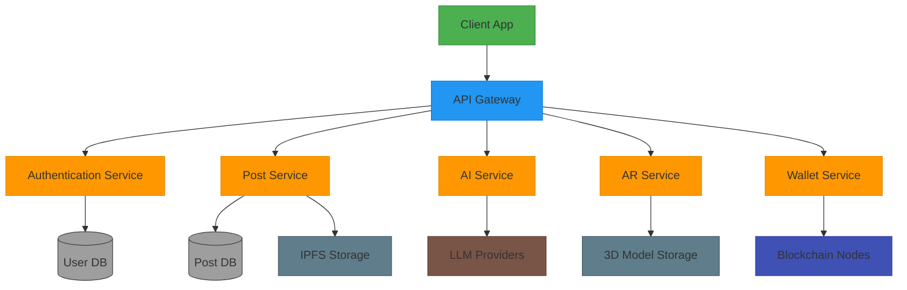
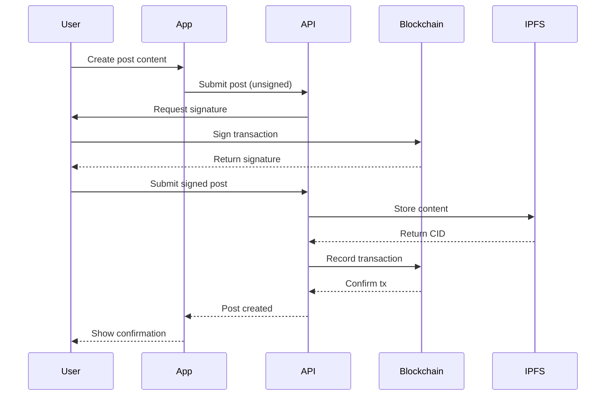
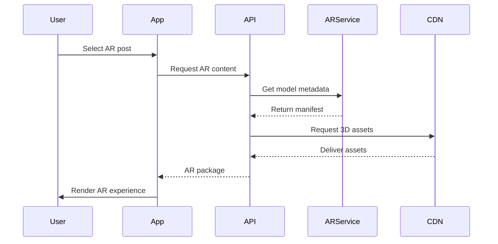
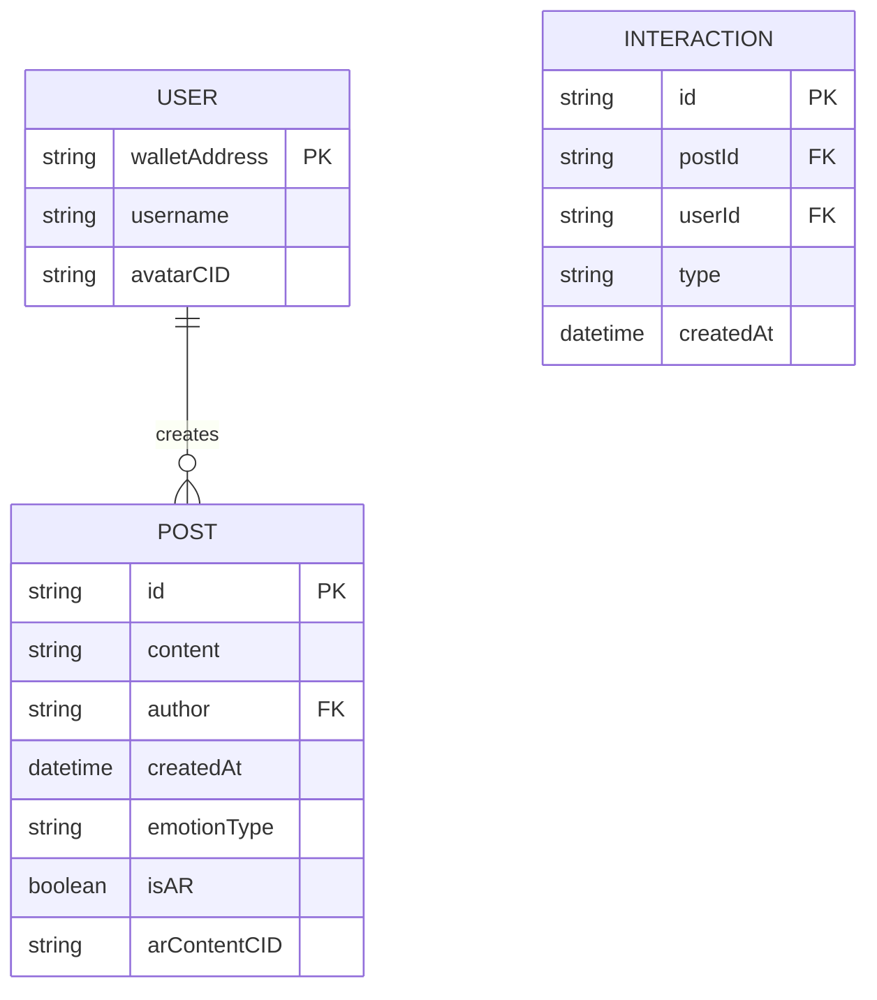

# EchoSphere Architecture



## Key User Flows

### Post Creation Sequence


### AR Post Viewing Sequence


## Key Components

### Frontend
- **Flutter Application**
  - Cross-platform mobile and web
  - State management with Provider
  - AR view integration

### Backend Services
1. **API Gateway**
   - Request routing
   - Rate limiting
   - Authentication

2. **Authentication Service**
   - Wallet-based auth
   - JWT token generation
   - Session management

3. **Post Service**
   - CRUD operations
   - Feed generation
   - Content moderation

4. **AI Service**
   - Sentiment analysis
   - Content summarization
   - Personalized recommendations

5. **AR Service**
   - 3D model processing
   - AR content delivery
   - Device compatibility

6. **Wallet Service**
   - Blockchain interactions
   - Transaction processing
   - Smart contract calls

### Data Storage
- **PostgreSQL** - Structured data
- **IPFS** - Decentralized content storage
- **S3** - AR assets and media

### External Integrations
- **Blockchain Networks** (Ethereum, Polygon)
- **AI Providers** (OpenAI, HuggingFace)
- **AR SDKs** (ARKit, ARCore)

## Data Models

### Post Model
```typescript
interface Post {
  id: string;
  content: string;
  author: string; // Wallet address
  timestamp: DateTime;
  summary?: string;
  emotionType: string;
  emotionScore: number;
  isAR: boolean;
  arContentUrl?: string;
  tipAmount: BigInt;
  viewCount: number;
  likeCount: number;
  shareCount: number;
  commentCount: number;
}
```

### User Profile
```typescript
interface UserProfile {
  walletAddress: string;
  username?: string;
  avatar?: string; // IPFS CID
  preferences: {
    theme: 'light'|'dark'|'auto';
    defaultPrivacy: 'public'|'private';
  };
  stats: {
    postCount: number;
    totalEarnings: BigInt;
  };
}
```

### Database Schema


## Security Architecture

### Authentication
- Wallet-to-server message signing
- JWT token expiration (1 hour)
- Refresh token rotation
- Rate limiting (100 requests/min)

### Data Protection
- IPFS content encryption
- Private post end-to-end encryption
- Secure wallet key storage
- TLS 1.3 for all communications

### Smart Contract Security
- OpenZeppelin standards
- Comprehensive unit tests
- Formal verification
- Multi-sig for upgrades

### Monitoring
- Anomaly detection
- Suspicious activity alerts
- Blockchain transaction monitoring
- Regular security audits

## Scaling Strategies

### Horizontal Scaling
- API service replication
- Read replicas for databases
- CDN for static assets
- Sharded blockchain nodes

### Performance Optimization
- AR content LOD (Level of Detail)
- AI response caching
- Feed pre-generation
- WebSockets for real-time updates

### Cost Management
- Layer 2 blockchain solutions
- AI model quantization
- Storage tiering (hot/cold)
- Spot instances for non-critical services
